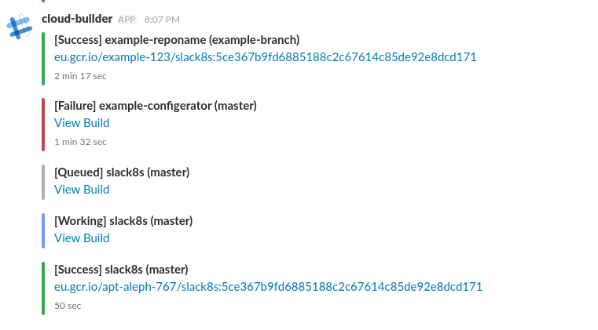

# cloudbuild-slack

[Google Cloud Function] that reports [Google Cloud Container Builder] progress to a slack channel.



## Installation

1. Setup a new incoming slack webhook URL: [instructions]
2. Clone this repo
3. Run `./config.sh` for config generation prompt
4. [Deploy from local machine] to your organizations project:

``` bash
gcloud beta function deploy <NAME> --stage-bucket <BUCKET_NAME> --trigger-topic cloud-builds --entry-point onbuildstatus
```

## Development

Get the [GCF Emulator] and run:
``` bash
functions deploy onbuildstatus --trigger-topic cloud-builds
```
Now you can do local modifications and try it out from your local machines:
``` bash
functions call onbuildstatus --file mock/mock.json
```


[deploy from local machine]: https://cloud.google.com/functions/docs/deploying/filesystem
[Google Cloud Container Builder]: https://cloud.google.com/container-builder/docs/
[Google Cloud Function]: https://cloud.google.com/functions/
[GCF Emulator]: https://cloud.google.com/functions/docs/emulator
[instructions]: https://api.slack.com/incoming-webhooks
